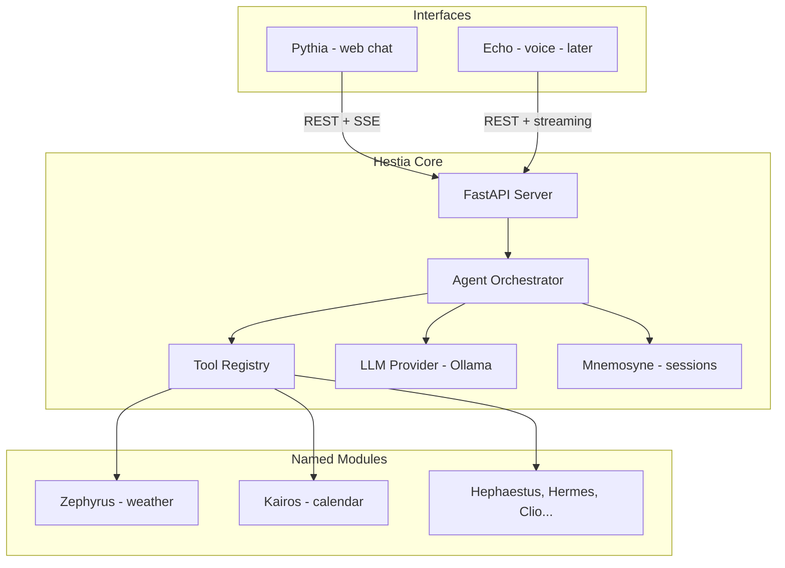

# Hestia: Modular Home Assistant AI

> **Plan status:** Phase 1 implemented  
> **Last updated:** 2025-06-23  
> **Canonical copy:** This file is the in-repo source of truth for architecture and phasing.  
> **Revision history:** See [docs/plan/CHANGELOG.md](plan/CHANGELOG.md)

## Goals

Build a **local-first** assistant that runs on your home server, uses **Ollama** for reasoning, and exposes capabilities through **standalone modules** — each with its own **Greek mythological** name. The first interface is **Pythia** (web chat); **Echo** (voice) is a follow-on module that plugs into the same core.

**This will be a public GitHub repository.** Security is a first-class requirement from day one — secrets never enter git, the API is authenticated, and deployment docs assume a hardened home-server setup.

## Module Naming (Greek Pantheon)

**Hestia** is the main AI — goddess of the hearth and home. Every follow-on module is named after a figure, deity, spirit, or muse from **Greek mythology only**. Names are used consistently across code (folder slugs), config keys, logs, and UI.

| Slug | Name | Domain | Greek mythology |
|------|------|--------|-----------------|
| `hestia` | **Hestia** | Core AI, orchestrator, API | Goddess of the hearth and home |
| `zephyrus` | **Zephyrus** | Weather | God of the west wind |
| `kairos` | **Kairos** | Calendar & scheduling | Spirit of the opportune moment |
| `pythia` | **Pythia** | Web chat interface | High priestess of Apollo's oracle at Delphi |
| `echo` | **Echo** | Voice interface | Nymph whose voice was all that remained |
| `mnemosyne` | **Mnemosyne** | Session & memory | Goddess of memory, mother of the Muses |
| `hephaestus` | **Hephaestus** | Smart home / devices | God of the forge — crafts and controls |
| `hermes` | **Hermes** | Messaging / MQTT | Messenger of the gods |
| `clio` | **Clio** | Reminders & notes | Muse of history and record-keeping |

**Naming rules:**
- **Greek mythology only** — no Roman, Norse, Egyptian, or other pantheons
- Use the Greek form, not the Roman equivalent (Hephaestus not Vulcan, Hermes not Mercury, Kairos not Janus, Zeus not Jupiter)
- Folder slugs are lowercase transliterations: `hestia/modules/zephyrus/`
- Config keys match slugs: `modules.zephyrus.enabled`
- Each module exposes a `display_name` (e.g. `"Zephyrus"`) and a one-line `domain` description for Hestia's system prompt
- Future modules must pick an unused **Greek** mythological name before implementation
- Reserved: `hestia` is never used for a sub-module

**Greek names reserved for future modules:**
- **Atlas** — maps and location
- **Iris** — notifications (goddess of the rainbow, divine messenger)
- **Aeolus** — wind/storm alerts (keeper of the winds)
- **Chronos** — timers and durations (personification of time; distinct from Kairos)
- **Prometheus** — automation rules and scheduled actions

## Recommended Stack

| Layer | Choice | Why |
|-------|--------|-----|
| Core runtime | **Python 3.11+** | Best ecosystem for Ollama, STT/TTS later, home-server deployment |
| API | **FastAPI** | Async, SSE streaming, easy to extend |
| LLM | **Ollama** (local) | Matches your local-first goal; abstract behind a provider interface |
| Agent loop | **Native tool-calling loop** | Simple, no heavy framework lock-in; add LangGraph only if complexity grows |
| Web UI (Pythia) | **React + Vite + TypeScript** | Chat UI with streaming; built as a standalone frontend consumed by FastAPI |
| Config | **YAML + `.env`** | Per-integration secrets; single `config.yaml` for core settings |
| Packaging | **uv** or **pip** + optional **Docker** | Easy install on home server |
| Cloud (optional) | **AWS** (free/low-cost tier only) | Backups, secrets, notifications, optional LLM fallback — never required |

## AWS (optional — free or low-cost only)

**Home server + Ollama remains the default runtime.** AWS is an opt-in supplement for specific features where the free tier or expected cost is negligible. Nothing in Phase 1 requires AWS.

**Cost guardrails:** disabled by default, billing alarm before enabling paid services, no AWS credentials in git.

| AWS service | Use in Hestia | Cost | Phase |
|-------------|---------------|------|-------|
| **S3** | Mnemosyne backup exports | ~pennies/month | 2 |
| **SSM Parameter Store** | Optional secrets backend | Free (standard) | 2 |
| **SES** | Iris email notifications | Free tier | 4 |
| **Lambda** | Webhook relay for Iris | Free tier | 4 |
| **Bedrock** | Optional cloud LLM fallback | Pay-per-token | 2+ |
| **EC2 t3.micro** | Alternative deploy target | 12-mo free tier | 2 |

AWS plugs in via `hestia/providers/` (secrets, backup, LLM) — not Greek-named modules. See full plan in Cursor copy for config examples.

## Architecture



## Module Model (the key to modularity)

Every capability is a self-contained package under `hestia/modules/` named after its mythological identity. Adding a new capability = pick a myth name, add a folder, register in config.

**Base contract** (`hestia/modules/base.py`):

```python
class HestiaModule(ABC):
  slug: str           # e.g. "zephyrus"
  display_name: str   # e.g. "Zephyrus"
  domain: str         # e.g. "Weather and forecasts"
  config_type: type[StrictConfig]

  async def setup(self, config: StrictConfig) -> None: ...
  async def teardown(self) -> None: ...
  def get_tools(self) -> list[RegisteredTool]: ...
```

**Tool registry** (`hestia/core/tools/registry.py`):
- Loads enabled modules from `config.yaml` by slug
- Merges all `get_tools()` into one tool list for the agent
- Routes tool calls back to the correct module (e.g. `zephyrus.get_forecast`)

**Module isolation rules:**
- Each module owns its config block, secrets, and HTTP clients
- No module imports another module
- Modules only talk to the outside world (APIs) and return structured results
- Failures in one module do not crash Hestia (wrap in try/except, return error to LLM)

## Security (public repo — built in from Phase 1)

Hestia controls your home and reads private data (calendar, devices). The **public source code** must contain zero secrets; **runtime security** must protect the API even on a home network.

### Repository hygiene (never leak secrets)

| Rule | Implementation |
|------|----------------|
| No secrets in git | `.gitignore` blocks `.env`, `config.yaml`, `*.pem`, `secrets/`, token files |
| Examples only | `config.yaml.example` and `.env.example` use placeholders (`your-token-here`, `${VAR}`) |
| CI secret scanning | GitHub Action runs **gitleaks** on every push/PR |
| Dependency alerts | **Dependabot** enabled for `pip`/`uv` and `npm` |
| No secrets in logs | Redact tokens, URLs with credentials, and iCal links in log output |
| No secrets in frontend | Never put API tokens in `VITE_*` env vars (they ship in the JS bundle) |

### API authentication

All chat endpoints (`POST /chat`, `POST /chat/stream` using SSE) require a **Bearer token** matching `HESTIA_API_TOKEN` from `.env`.

- Token is generated by the user on first setup (`openssl rand -hex 32`)
- `/health` stays unauthenticated (for Docker/orchestrator probes only)
- Streaming auth uses the `Authorization` header (never a query parameter)
- **Configurable rate limiting** applies to chat routes per client IP
- Return `401` without leaking whether the token format is wrong vs missing

### LLM and tool execution safety

- Tools are **explicitly registered** — the LLM cannot execute arbitrary code or shell commands
- Each tool validates its parameters against a JSON schema before execution
- Module tools declare a `risk_level`: `read` (default) or `write` (future Hephaestus)
- `write` tools require a confirmation step before execution (Phase 4)
- System prompt instructs Hestia: never reveal API tokens, env vars, or iCal URLs in responses

## Secrets & Configuration Storage

| Store | Location | Holds |
|-------|----------|-------|
| **`.env`** | Project root (gitignored) | All secrets: `HESTIA_API_TOKEN`, `CALENDAR_ICAL_URL`, OAuth keys, device tokens |
| **`config.yaml`** | Project root (gitignored) | Non-secret settings; secret references via `${VAR}` only |
| **`~/.hestia/`** | Home server (Phase 2+) | `mnemosyne.db`, OAuth refresh tokens |
| **`sessionStorage`** | Browser (Pythia) | Ephemeral copy of `HESTIA_API_TOKEN` for API calls |

**Never holds secrets:** git repo, `VITE_*` vars, React build, LLM context, logs.

## Project Structure

```
Project Hestia/
├── docs/
│   ├── PLAN.md                 # this file — architecture & phasing
│   └── plan/
│       └── CHANGELOG.md        # plan revision history
├── pyproject.toml
├── config.yaml.example
├── .env.example
├── .gitignore
├── SECURITY.md
├── .github/
│   ├── dependabot.yml
│   └── workflows/
│       ├── ci.yml
│       └── security.yml
├── docker-compose.yml
├── hestia/
│   ├── core/
│   ├── security/
│   ├── modules/
│   │   ├── zephyrus/
│   │   └── kairos/
│   ├── interfaces/
│   │   ├── pythia/
│   │   └── echo/
│   └── api/
└── tests/
```

## Implementation Phases

### Phase 1 — Foundation (build first)
- Project scaffold, security CI, auth middleware
- Hestia core + Ollama + orchestrator
- **Zephyrus** (weather), **Pythia** (React chat UI)
- Tests for orchestrator, auth, Zephyrus

### Phase 2 — Kairos + polish
- **Kairos** calendar (iCal URL)
- Mnemosyne SQLite persistence
- Optional AWS: S3 backups, SSM secrets (disabled by default)
- Docker Compose for home server

### Phase 3 — Echo
- **Echo** voice interface (local STT → authenticated API → local TTS)
- Bounded raw-audio API and local faster-whisper/Piper inference first
- Microphone client follows the stable voice API contract

### Phase 4 — Expand the pantheon
- **Hephaestus** (Home Assistant), **Hermes** (MQTT), **Clio** (reminders)
- **Iris** (notifications — AWS SES free tier, optional Lambda)

## Key Design Decisions

1. **Python core, React frontend**
2. **Greek mythology naming only**
3. **Module protocol over MCP (for now)**
4. **iCal before Google OAuth for Kairos**
5. **Mnemosyne in-memory first**, SQLite in Phase 2
6. **No framework lock-in** on LLM provider
7. **Security by default** for public repo
8. **AWS optional, never required** — free/low-cost tier only; disabled by default

## Success Criteria for Phase 1

- `hestia serve` starts API + serves Pythia; chat endpoints reject unauthenticated requests
- `gitleaks` CI passes; `.env` and `config.yaml` are gitignored
- User can ask "What's the weather in [city]?" and Zephyrus returns a real forecast
- Adding a new module requires: pick a myth name, new folder, config entry, `get_tools()` implementation
- Everything runs locally with Ollama; Ollama not exposed beyond localhost

## Implementation Checklist

Track build progress here. Update as phases complete.

- [x] Phase 1 — Foundation
  - [x] Repo scaffold + `docs/PLAN.md`
  - [x] Security (auth, rate limit, gitleaks CI)
  - [x] Hestia core + orchestrator
  - [x] Zephyrus module
  - [x] Pythia React UI
- [ ] Phase 2 — Kairos + deployment
  - [x] Secure read-only Kairos iCal module
  - [x] Mnemosyne SQLite persistence and retention
  - [x] Hardened Docker Compose deployment
  - [ ] Optional S3 backups and SSM secrets
- [x] Phase 3 — Echo
  - [x] Authenticated, bounded local STT → orchestrator → TTS API
  - [x] Same-origin microphone capture and audio playback client
- [ ] Phase 4 — Hephaestus, Hermes, Clio
